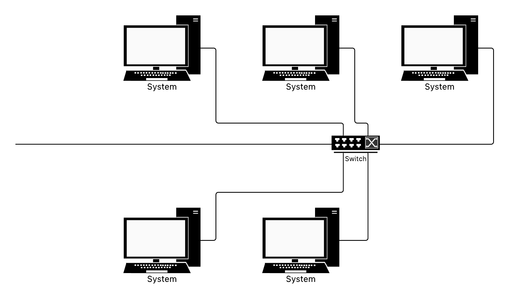
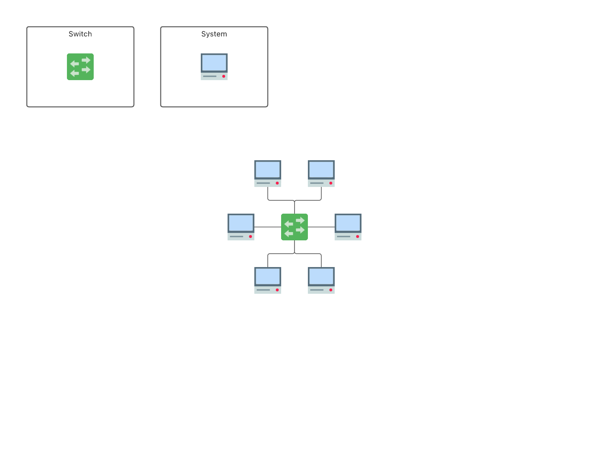
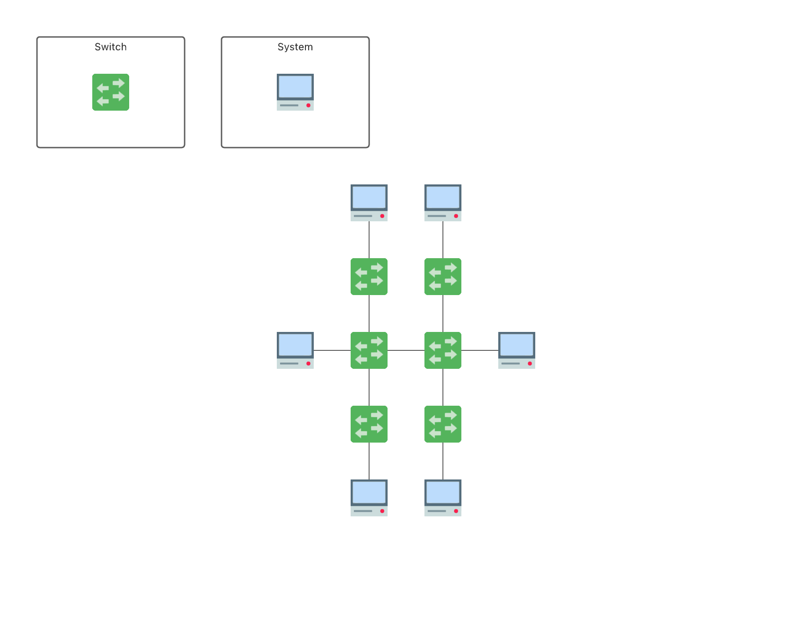

# Network-Function-Simulation


A network function simulation project coded on cpp. It features a series of simulated network components including switches, systems, frame decoders, and etc.

It uses multi-threading to run different components in parallel and uses IPC to pass messages between them.

## Running The Project

To build the code, run:

```
make
```

## User Guide



There are two main classes, Switch and System. Each instance of switch and system will run on a different process.

## Switch

This command creates a switch with the number of ports given by you. Another parameter is the switch number to which you are assigning. A switch also forms an internal address lookup table that is initially empty.

```
Switch <number_of_ports> <switch_number>
```

## System

This command creates a computer system with the system number given by you.

```
System <system_number>
```

## Connection

This command connects a system to a switch.

```
Connect <system_number> <switch_number> <port_number>
```

This command connects two switches.

```
ConnectSwitch <switch_number> <switch_number> <port_number>
```

### Frame

Each frame is 128 bytes (characters).

|   32   |  64  |    32   |
|:------:|:----:|:-------:|
| Header | Data | Address |

### Sending frames

To send frames from one system to another.

```
Send <system_number> <system_number>
```

### SpanningTree

To eliminate the cycles in-network, run the Spanning Tree algorithm.

```
SpanningTree
```

## How to use

### Build

To build Network run:

```
make
```

### Run

To run Network, run:

```
./Network
```

## Test

Different topologies will be used to simulate network performance.

### Case 1

```
MySystem 0
MySystem 1
MySystem 2
MySystem 3
MySystem 4
MySystem 5

MySwitch 6 0

Connect 0 0 0
Connect 1 0 1
Connect 2 0 2
Connect 3 0 3
Connect 4 0 4
Connect 5 0 5

Send 0 1
Send 1 3
Send 3 5
Send 5 0
```



### Case 2

```
MySystem 0
MySystem 1
MySystem 2
MySystem 3
MySystem 4
MySystem 5

MySwitch 6 0
MySwitch 6 1
MySwitch 6 2
MySwitch 6 3
MySwitch 6 4
MySwitch 6 5

Connect 0 0 0
Connect 1 1 0
Connect 2 2 0
Connect 3 3 0
Connect 4 4 0
Connect 5 5 0

ConnectSwitch 0 1 1
ConnectSwitch 0 2 2
ConnectSwitch 1 3 3
ConnectSwitch 0 4 4
ConnectSwitch 1 5 5

Send 0 1
Send 2 4
```



## Case 3

```
MySystem 0
MySystem 1
MySystem 2

MySwitch 20 0
MySwitch 20 1
MySwitch 20 2
MySwitch 20 3
MySwitch 20 4
MySwitch 20 5

Connect 0 0 0
Connect 1 2 0
Connect 2 4 0

ConnectSwitch 0 1 1
ConnectSwitch 1 2 2
ConnectSwitch 2 3 3
ConnectSwitch 3 4 4
ConnectSwitch 4 5 5
ConnectSwitch 5 0 6

SpanningTree

Send 0 1
Send 1 2
```
